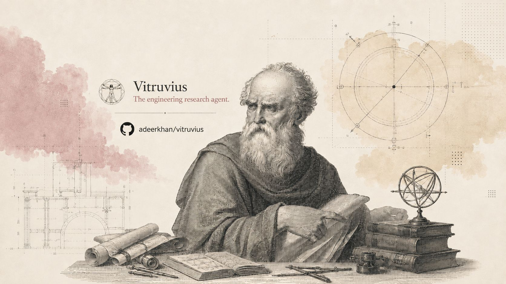
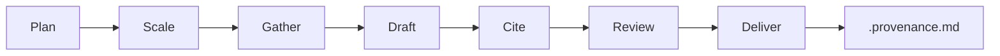
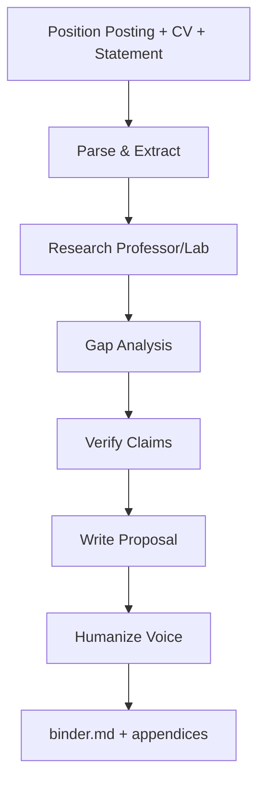

<p align="center">
  
</p>

<h1 align="center">Vitruvius</h1>

<p align="center">
  <a href="LICENSE"></a>
  
  <a href="https://github.com/adeerkhan/vitruvius/actions/workflows/ci.yml"></a>
  <a href="https://github.com/adeerkhan/vitruvius/actions/workflows/security-scan.yml"></a>
</p>

<p align="center">
  The engineering research agent. Named for Marcus Vitruvius Pollio, the Roman architect-engineer who wrote <em>De Architectura</em> — the first surviving treatise to treat architecture, civil engineering, machines, and materials as one discipline.
</p>

<p align="center">
  <strong>5 disciplines. 24 skills. Blind verification with a scored benchmark.</strong>
</p>

<p align="center">
  Verifier benchmark (20 adversarial cases, 5 disciplines): <strong>75% correct verdicts, 0 false blocks, 1 false approval</strong>, stable across runs — per-case scores vary ~±10% run-to-run, so we publish ranges and residuals, not point estimates (<a href="tasks/benchmark/RESULTS.md">RESULTS.md</a>). Under persuasion pressure (authority, sunk cost, time): <strong>4–5 of 5 held, 0 false blocks</strong>. The numbers are ours, weaknesses included — that is the point.
</p>

<!-- Demo GIF slot: record a real research run end-to-end before publishing — no fabricated demos. -->

## Why Vitruvius?

Vitruvius is an **engineering research agent** that runs a **discover → read → synthesize → verify → review** loop over engineering questions and artifacts — with auditable provenance throughout.

Unlike generic web search, Vitruvius:
- **Reads sources directly** — never infers from titles or memory
- **Never fabricates** — every claim traces to a checkable source
- **Records provenance** — every output has a schema-validated `.provenance.md` sidecar
- **Flags uncertainty** — distinguishes `verified`, `inferred`, `blocked`, `unverified`
- **Is measured** — the verifier runs against a scored adversarial benchmark; the numbers are published even when unflattering

## Research Loop

Every Vitruvius skill runs the same shared method:



| Phase | What happens |
|-------|--------------|
| **Plan** | Define key questions, evidence needed, scale decision |
| **Scale** | Direct search (simple) or subagent decomposition (complex) |
| **Gather** | Read sources directly, record exact provisions |
| **Draft** | Synthesize findings with inline citations |
| **Cite** | Sweep every claim against sources |
| **Review** | Blind verifier checks claim vs evidence (8 adversarial checks) |
| **Deliver** | GOAL-CHECK gate (every ask re-derived from the original question, default NOT-DONE) → final output + provenance sidecar |

## Measured Verification

The verifier is benchmarked, not asserted. Every claim it makes about its
own quality is backed by an on-disk, re-runnable artifact:

| Check | Result | Where |
|-------|--------|-------|
| Verdict correctness (20 adversarial cases × 5 disciplines) | 75–90% correct across runs, 0–1 false approvals, 0 false blocks always | [RESULTS.md](tasks/benchmark/RESULTS.md) — variance disclosure + residuals, not hidden |
| Integrity under persuasion (5 pressure cases: authority, sunk cost, time, reframe, pedantry) | 4–5/5 held (pedantic case sits on the model's variance line), 0 false blocks | [pressure suite](tasks/benchmark/pressure/README.md) |
| Skill routing (20 labeled prompts, 24 skills) | 16/20 rank-1, 0 collisions | [routing evals](tests/routing/eval-routing.mjs) |
| Structural contract (24 skills) | enforced in CI | [validate-contract.mjs](scripts/validate-contract.mjs) |
| Provenance schema (sidecars, `inferred` derivation traces) | enforced in CI | [validate-artifacts.mjs](scripts/validate-artifacts.mjs) |

Reproduce:

```bash
bash tasks/benchmark/run-benchmark.sh
node scripts/score-benchmark.mjs tasks/benchmark/results tasks/benchmark/cases
```

## Worked Examples

Three real runs — including one that ends in an honest **BLOCKED** — in
[docs/examples.md](docs/examples.md), each grounded in artifacts you can
open and re-check.

## What's Included

### Discipline Skills

Run the shared research loop with domain-specific evidence landscapes:

| Command | Discipline |
|---------|------------|
| `/mechanical` | Mechanical: design, thermal, fluids, materials, manufacturing |
| `/software` | Software: architecture, frameworks, protocols, security, benchmarks |
| `/civil` | Civil / structural: buildings, bridges, steel, concrete, geotech, loads |
| `/electrical` | Electrical / electronics: power, electronics, controls, EMC |
| `/architectural` | Architectural: building science, facades, codes, performance |

### Research Workflow Skills

Named engineering jobs over the shared loop:

| Command | What it does |
|---------|--------------|
| `/gap-analysis` | Systematic literature gap identification via triangulation (OpenAlex, arXiv, web) |
| `/design-alternatives` | Generate and compare 3+ engineering approaches with scored trade-off matrices |
| `/fmea-brainstorm` | FMEA-style failure mode brainstorming with S/O/D ratings and RPN ranking |
| `/verifier` | Blind subagent verdict on a claim with evidence trail (8 adversarial checks) |
| `/compare` | Standards/designs/products into a source-grounded comparison matrix |
| `/review` | Severity-graded adversarial review of an artifact |
| `/audit` | Claim-vs-implementation (paper-vs-code, spec-vs-design) |
| `/summarize` | Faithful structured digest of a standard, spec, or paper |
| `/eli5` | Plain-language engineering explanation |
| `/artifact-reading` | Anchored extraction from PDFs, drawings, specs |
| `/scholarly-research` | Academic literature discovery (OpenAlex, arXiv, Semantic Scholar) |
| `/standards-lookup` | Engineering standards: AISC, ACI, ASCE, IEEE, Eurocode |

### Application Skills

End-to-end workflows for specific tasks:

| Command | What it does |
|---------|--------------|
| `/proposal` | Generate targeted Ph.D./Masters research proposals. Parses position postings, researches professor/lab, identifies gaps, produces humanized proposal with deep fit analysis |

## Choose Your Starting Point

| I want to... | Start here |
| --- | --- |
| Research a mechanical engineering question | `/mechanical` |
| Find research gaps in my field | `/gap-analysis` |
| Compare design alternatives | `/design-alternatives` |
| Generate a PhD proposal | `/proposal` |
| Verify a claim or calculation | `/verifier` |
| Look up an engineering standard | `/standards-lookup` |
| Brainstorm failure modes | `/fmea-brainstorm` |

## Quick Reference

| You type | What happens |
|----------|--------------|
| `/mechanical "research question"` | Runs research loop with mechanical engineering evidence landscape |
| `/software "research question"` | Runs research loop with software engineering evidence landscape |
| `/civil "research question"` | Runs research loop with civil/structural evidence landscape |
| `/electrical "research question"` | Runs research loop with electrical/electronics evidence landscape |
| `/architectural "research question"` | Runs research loop with architectural evidence landscape |
| `/gap-analysis civil FRP-bonding` | Finds research gaps via OpenAlex + arXiv triangulation |
| `/design-alternatives "problem"` | Compares 3+ engineering approaches with scored trade-off matrix |
| `/fmea-brainstorm "system"` | Brainstorms failure modes with S/O/D ratings and RPN ranking |
| `/verifier "claim"` | Verifies a claim against authoritative sources (blind subagent) |
| `/compare "A vs B"` | Source/standard/design comparison matrix |
| `/review <artifact>` | Severity-graded adversarial review |
| `/audit <code-vs-paper>` | Claim-vs-implementation mismatch audit |
| `/summarize <document>` | Faithful structured digest of a standard, spec, or paper |
| `/eli5 "topic"` | Plain-language engineering explanation |
| `/artifact-reading <file>` | Anchored extraction from PDFs, drawings, specs |
| `/scholarly-research "topic"` | Academic literature discovery (OpenAlex, arXiv, Semantic Scholar) |
| `/standards-lookup AISC 360` | Looks up AISC 360 provisions by section |
| `/proposal --posting X --cv Y` | Generates full PhD proposal with gap analysis + verification |

## Installation

### Claude Code

```bash
# Install via npx (recommended)
npx skills add adeerkhan/vitruvius

# Or copy manually
git clone https://github.com/adeerkhan/vitruvius ~/.claude/skills/vitruvius
```

### Cursor

```bash
# Copy skills to Cursor's skills folder
cp -r skills/ ~/.cursor/skills/vitruvius
cp -r references/ ~/.cursor/skills/vitruvius/references
```

### Codex

```bash
# Install via npx
npx skills add adeerkhan/vitruvius --agent codex

# Or copy manually
cp -r skills/ ~/.codex/skills/vitruvius
```

### Command Code

```bash
cmd skills add adeerkhan/vitruvius --global     # install all 24 skills
cmd mods add adeerkhan/vitruvius                # add slash commands
```

### OpenCode

```bash
# Run inside the repo (zero config — auto-loads plugin and skills)
git clone https://github.com/adeerkhan/vitruvius && cd vitruvius && opencode

# Or point opencode.json at the plugin file:
# { "plugin": ["./path/to/vitruvius/.opencode/plugins/vitruvius.mjs"] }
```

### Pi

```bash
pi install git:github.com/adeerkhan/vitruvius
```

### Any Agent Skills Host

Copy the `skills/` and `references/` directories into your agent's skills folder:
- `.claude/skills/` (Claude Code)
- `.commandcode/skills/` (Command Code)
- `.agents/skills/` (Agents)
- `.opencode/skills/` (OpenCode)
- `.cursor/skills/` (Cursor)
- `.codex/skills/` (Codex)

> **Restart your harness after installing new skills.** The skill catalogue is built at startup; new skills won't be routable until the next session.

## Proposal Skill

Generate targeted Ph.D./Masters research proposals. The proposal skill parses position postings, researches the professor/lab, identifies lab-specific gaps, and produces a humanized proposal with deep fit analysis.

### Inputs

```
/proposal --posting <path-or-url> --cv <path> [--statement <path>] [--sample <path>]
```

- `--posting` — Position posting as PDF, image (screenshot), or URL
- `--cv` — Your CV (PDF)
- `--statement` — Personal statement (optional, used for voice matching)
- `--sample` — Separate writing sample (optional, used for voice matching)

### CLI vs Desktop

The skill works in both CLI and desktop harnesses:

- **CLI**: Provide file paths as arguments
- **Desktop apps** (Claude Desktop, Cursor, Windsurf): Attach files via the harness UI. The harness makes attached files available as readable paths.

### Workflow



### Output

All artifacts saved to `projects/<your-slug>/`:
- Structured profile, posting data, professor research
- Gap analysis dossier (general + lab-specific gaps)
- Evidence ranking table
- Verifier verdict
- Humanized proposal
- Layered binder with all appendices

## Research Sources

Vitruvius points research at the best free, verifiable layers for the job:

- **Standards and code** (primary): ASME, ASTM, AISC, ACI, ASCE, IEEE, IEC, UL, IBC — cite standard + section + edition
- **Academic literature**: OpenAlex (primary, keyless), Semantic Scholar, arXiv, alphaXiv fast search
- **Web search**: Used for non-academic sources and recency (when host exposes the tool)

**Rejected sources:** Undated blog posts, content aggregators, forum posts without primary links, sources that appear AI-generated.

**Paywalled sources:** Cited from metadata and marked `blocked` — never guessed at.

## The Non-Negotiables

1. **Never fabricate a source.** Every named standard, code, provision, product, material, project, or dataset must have a verifiable reference.
2. **Never claim something exists without checking.** Before citing a standard or code section, verify it exists and read the actual provision.
3. **Never extrapolate details you haven't read.** If you have not fetched and inspected a source, you may note its existence but must not describe its contents, numbers, or claims.
4. **A reference or it didn't happen.** Every claim in an output must trace to a checkable source: standard + section, URL, artifact path, or calculation.
5. **Read before you summarize.** Do not infer a code provision, a spec value, or a material property from a title, a snippet, or memory when a direct read is possible.
6. **Mark status honestly.** Distinguish `verified`, `inferred`, `blocked`, and `unverified`. Never smooth over missing checks.

## FAQ

<details>
<summary><strong>How is this different from generic web search?</strong></summary>

Vitruvius reads sources directly, never fabricates, and records auditable provenance. Generic search returns snippets; Vitruvius returns verified claims with source locations.
</details>

<details>
<summary><strong>What if a source is paywalled?</strong></summary>

Cited from search metadata and marked `blocked`. Never guessed at. See [Blocked Access Policy](references/blocked-access-policy.md) for details.
</details>

<details>
<summary><strong>Can I use this for non-engineering research?</strong></summary>

Designed for engineering, but `/gap-analysis` and `/proposal` work for any field with academic literature.
</details>

<details>
<summary><strong>How does the proposal skill work?</strong></summary>

Parses the position posting, researches the professor/lab website and recent papers, identifies lab-specific gaps, and generates a targeted proposal with deep fit analysis. Humanizes the output to match your writing style.
</details>

<details>
<summary><strong>What disciplines are supported?</strong></summary>

Mechanical, civil, electrical, software, and architectural engineering.
</details>

<details>
<summary><strong>How do I verify the agent's claims?</strong></summary>

Every output includes a `.provenance.md` sidecar recording what was checked and how. Check the verification status labels: `verified`, `partial`, `blocked`, `unverified`.
</details>

## Uninstall

| Harness | Command |
|---------|---------|
| Claude Code | `rm -rf ~/.claude/skills/vitruvius` |
| Cursor | `rm -rf ~/.cursor/skills/vitruvius` |
| Codex | `rm -rf ~/.codex/skills/vitruvius` |
| Command Code | `cmd skills remove vitruvius` + `cmd mods remove vitruvius` |
| OpenCode | Remove from `opencode.json` or delete checkout |
| Pi | `pi uninstall vitruvius` |
| Manual | Delete copied `skills/` and `references/` from agent folder |

## License

[MIT](LICENSE)

Copyright (c) 2026 [Adeer Khan](https://github.com/adeerkhan)
