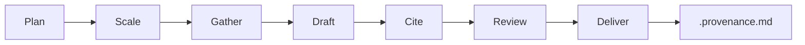
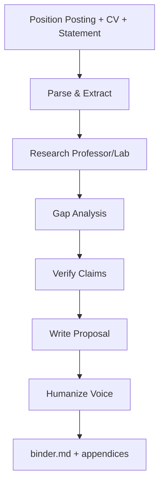

<p align="center">
  
</p>

<h1 align="center">Vitruvius</h1>

<p align="center">
  <a href="LICENSE"></a>
  
  <a href="https://github.com/adeerkhan/vitruvius/actions/workflows/ci.yml"></a>
  <a href="https://github.com/adeerkhan/vitruvius/actions/workflows/security-scan.yml"></a>
</p>

<p align="center">
  The engineering research agent. Named for Marcus Vitruvius Pollio, the Roman architect-engineer who wrote <em>De Architectura</em> — the first surviving treatise to treat architecture, civil engineering, machines, and materials as one discipline.
</p>

<p align="center">
  <strong>5 disciplines. 25 skills. Blind verification with a scored benchmark.</strong>
</p>

<p align="center">
  Verifier benchmark (20 adversarial cases + 5 deterministic PASS scoring fixtures, 5 disciplines): the latest checked-in adversarial run reports <strong>75% correct verdicts, 1 false approval, 0 false blocks, and 1 conservative overcall</strong>; the scoring fixtures score <strong>5/5</strong>. The scorer now fails closed on missing, malformed, duplicate, or unknown results. Per-case variance remains material, so these are reported measurements, not certification (<a href="tasks/benchmark/RESULTS.md">RESULTS.md</a>). The latest pressure artifact reports <strong>4/5 held with one false approval</strong>; no false-block guarantee is claimed. The numbers are ours, weaknesses included — that is the point.
</p>

<!-- Demo GIF slot: record a real research run end-to-end before publishing — no fabricated demos. -->

## Why Vitruvius?

Vitruvius is an **engineering research agent** that runs a **discover → read → synthesize → verify → review** loop over engineering questions and artifacts — with auditable provenance throughout.

Unlike generic web search, Vitruvius:
- **Reads sources directly** — never infers from titles or memory
- **Never fabricates** — every claim traces to a checkable source
- **Records provenance** — research outputs are intended to have schema-validated `.provenance.md` sidecars; the current validator covers selected root/plan/draft paths, while nested and method-specific sidecars remain a known gap
- **Flags uncertainty** — distinguishes `verified`, `inferred`, `blocked`, `unverified`
- **Is measured** — the verifier runs against a scored adversarial benchmark plus deterministic PASS controls; the numbers are published even when unflattering
- **Learns deliberately** — Habit captures only explicit, user-approved research preferences in a project-local store; it never silently rewrites agent instructions

## Research Loop

Every Vitruvius skill runs the same shared method:



| Phase | What happens |
|-------|--------------|
| **Plan** | Define key questions, evidence needed, scale decision |
| **Scale** | Direct search (simple) or subagent decomposition (complex) |
| **Gather** | Read sources directly, record exact provisions |
| **Draft** | Synthesize findings with inline citations |
| **Cite** | Sweep every claim against sources |
| **Review** | Blind verifier checks claim vs evidence (8 adversarial checks) |
| **Deliver** | GOAL-CHECK gate (every ask re-derived from the original question, default NOT-DONE) → final output + provenance sidecar |

## Measured Verification

The verifier is benchmarked, not asserted. Its checked-in results are on-disk, re-runnable artifacts with known control and variance limitations:

| Check | Result | Where |
|-------|--------|-------|
| Verdict correctness (20 adversarial cases × 5 disciplines) | Latest checked-in run: 75% correct, 1 false approval, 0 false blocks, 1 conservative overcall; flaw-type accuracy is reported separately; variance is material | [RESULTS.md](tasks/benchmark/RESULTS.md) — residuals and limitations, not hidden |
| PASS scoring fixtures (5 disciplines) | 5/5 parser/scorer fixtures; these are not independent verifier runs | [control cases](tasks/benchmark/controls/cases) |
| Benchmark integrity | Missing, malformed, duplicate, and unknown result files fail closed | [benchmark scorer](scripts/benchmark-scoring.mjs) |
| Integrity under persuasion (5 pressure cases: authority, sunk cost, time, reframe, pedantry) | Latest artifact: 4/5 held with one false approval; no false-block guarantee is claimed | [pressure suite](tasks/benchmark/pressure/README.md) |
| Skill routing (20 labeled prompts, 25 skills) | 16/20 rank-1, 0 collisions | [routing evals](tests/routing/eval-routing.mjs) |
| E1 evaluation pilot | 4 fixture-backed priority skills; positive top-k 4/4 and owner-negative 4/4; full 25-skill coverage remains open | [evals/catalog.json](evals/catalog.json) |
| C1 fixed-case pilot | 3 local-only cases, 3 fresh subagent runs, independent review 3/3; host model cost unavailable | [evals/results/manifest.json](evals/results/manifest.json) |
| GC1 GOAL-CHECK contract | deterministic positive/omitted-ask/repeated-gap fixtures; valid `NOT-DONE` is not promotable | [goal-check-contract.mjs](scripts/goal-check-contract.mjs) |
| PR1 artifact closure | nested final/provenance, stale-byte, orphan, and path-escape fixtures | [artifact-closure.mjs](scripts/artifact-closure.mjs) |
| V1 field-pilot contract | format and refusal tests only; no real external-source result claimed | [field-pilot README](evals/field-pilot/README.md) |
| Problem-anchor contract | anchors resolve to non-blank lines on disk; unanchored `repo` claims, uncited anchors, decisions with no finding, and empty negative coverage all fail closed | [problem-anchor-contract.mjs](scripts/problem-anchor-contract.mjs) |
| Structural contract (25 skills) | enforced in CI | [validate-contract.mjs](scripts/validate-contract.mjs) |
| Provenance schema (selected sidecars, `inferred` derivation traces) | selected root/plan/draft checks plus deterministic generic closure fixtures; legacy local closure remains opt-in | [validate-artifacts.mjs](scripts/validate-artifacts.mjs) |

Reproduce:

```bash
# Run fresh blind cases; the runner exits nonzero if any expected verdict is missing
bash tasks/benchmark/run-benchmark.sh

# Score checked-in results and deterministic PASS controls
node scripts/score-benchmark.mjs tasks/benchmark/results tasks/benchmark/cases
node scripts/score-benchmark.mjs tasks/benchmark/controls/results tasks/benchmark/controls/cases

# Optional certification gate: also fail on any false approval or false block
node scripts/score-benchmark.mjs --strict-quality tasks/benchmark/results tasks/benchmark/cases

# Deterministic contract checks; these do not call a model
npm run test:evals
npm run test:goal-check
npm run test:artifacts
npm run test:field-pilot
npm run test:problem-anchor
npm run test:package-contract
npm run test:package-consumer
npm run test:input-gate
node tests/routing/eval-routing.mjs
node scripts/fixed-case.mjs case evals/cases/local-evidence-suite.json
node scripts/fixed-case.mjs results evals/results/manifest.json evals/results
```

The E1/C1 subagent runs are on-demand evidence and are not part of `npm test`; the checked-in C1 bundle records their artifact hashes and independent grades. GC1, PR1, and V1 are deterministic contract checks; V1 still requires a real pilot record before any outcome claim. The problem-anchor contract is also deterministic: it proves a report is bound to the artifacts it studied, not that its claims are correct. When installed as a package, the same validators are available as `vitruvius-goal-check`, `vitruvius-artifact-closure`, `vitruvius-field-pilot`, and `vitruvius-problem-anchor`; `test:package-consumer` proves that by installing the packed tarball into a clean consumer. `test:input-gate` proves every standalone research skill declares the shared gate in `references/input-gate.md`.

## Worked Examples

Three real runs — including one that ends in an honest **BLOCKED** — in
[docs/examples.md](docs/examples.md), each grounded in artifacts you can
open and re-check.

## What's Included

### Discipline Skills

Run the shared research loop with domain-specific evidence landscapes:

| Command | Discipline |
|---------|------------|
| `/mechanical` | Mechanical: design, thermal, fluids, materials, manufacturing |
| `/software` | Software: architecture, frameworks, protocols, security, benchmarks |
| `/civil` | Civil / structural: buildings, bridges, steel, concrete, geotech, loads |
| `/electrical` | Electrical / electronics: power, electronics, controls, EMC |
| `/architectural` | Architectural: building science, facades, codes, performance |

### Research Workflow Skills

Named engineering jobs over the shared loop:

| Command | What it does |
|---------|--------------|
| `/gap-analysis` | Systematic literature gap identification via triangulation (OpenAlex, arXiv, web) |
| `/design-alternatives` | Generate and compare 3+ engineering approaches with scored trade-off matrices |
| `/fmea-brainstorm` | FMEA-style failure mode brainstorming with S/O/D ratings and RPN ranking |
| `/hypothesis-generation` | Freeze rival hypotheses with dated evidence boundaries and discriminating tests |
| `/peer-review` | Severity-graded adversarial peer review with a revision plan |
| `/engineering-research` | Shared research method: discover → read → synthesize → verify → review |
| `/verifier` | Blind subagent verdict on a claim with evidence trail (8 adversarial checks) |
| `/compare` | Standards/designs/products into a source-grounded comparison matrix |
| `/review` | Severity-graded adversarial review of an artifact |
| `/audit` | Claim-vs-implementation (paper-vs-code, spec-vs-design) |
| `/summarize` | Faithful structured digest of a standard, spec, or paper |
| `/eli5` | Plain-language engineering explanation |
| `/artifact-reading` | Anchored extraction from PDFs, drawings, specs |
| `/scholarly-research` | Academic literature evidence layer (OpenAlex, arXiv, Semantic Scholar) with need-based routing modes, code prior-art search, and page-anchored open-access PDF reading; synthesis goes to `/engineering-research` |
| `/standards-lookup` | Engineering standards: AISC, ACI, ASCE, IEEE, Eurocode |
| `/habit` | Extract explicit research preferences, validate them, and activate only human-approved rules in a project-local store |

`/engineering-research` and the discipline skills default to **thorough**
research. Pass `--deep` to force multi-agent coverage, `--quick` for an explicit
fast lookup, or `--turns N` / `--budget N` (or plain language like "run ~200
turns") to set your own effort ceiling. With no budget, the run continues while
new grounded evidence is still arriving.

## Grounding: keeping a report about your problem

A fully cited literature review that never opens the codebase it was commissioned
about passes every citation check and answers nobody. Vitruvius closes that with
rules, not exhortation:

1. **Name the artifacts before searching** — the files, repos, or documents the
   run studies, plus the commit. The record hash-pins the files, so the snapshot
   is the hash set; the commit is recorded for the reader.
2. **`repo` claims carry an anchor** — a claim about the artifact under study
   resolves to `path:line` on disk. You cannot assert a codebase does, lacks, or
   needs something without opening it.
3. **Every finding names its landing site** — `change`, `measure`, `defer`,
   `product-decision`, or `background`. A finding with no landing site is
   background or a product decision and has to say which.
4. **Every decision gets a position** — a report may not list a decision and
   then ignore it.
5. **Silence is not a finding** — record what you searched for, did not find, and
   the search boundary.
6. **Weight follows evidence** — an impact or priority claim states the evidence
   behind it and the cost of being wrong.

`/scholarly-research` is the evidence layer and does not write the report;
/`/engineering-research` owns these rules and writes the deliverable. The
deterministic half is machine-checked:

```bash
node scripts/problem-anchor-contract.mjs <record.json>
```

The record binds the run to the artifacts it studied, requires every declared
decision to reach a finding, resolves every `repo` anchor against real
non-blank bytes, and requires the report to actually cite them. It does **not**
read the claim: an anchor that resolves but says the opposite still passes, so
rules 2 and 3 are narrowed, not closed. See
[the contract reference](skills/engineering-research/references/problem-anchor-contract.md).

`npm run check:local-artifacts` is the opt-in check over your local `outputs/`
tree. Research deliverables written before this contract predate its three
grounding checks and will be reported; that is expected local debt, the same
way legacy closure debt is.

## Habit Learning

Habit is an explicit, review-gated preference loop for research conventions—not passive memory and not model training:

1. `/habit` captures a bounded run window and asks the read-only habit role for candidates.
2. The lead validates user-only evidence, stable ids, scope, expiry, duplicates, and secret redaction.
3. The user approves or rejects candidates explicitly.
4. Approved rules enter the project-local `outputs/.habits/active.json` store.
5. A later unrelated run can load scoped rules with `node scripts/habit-ledger.mjs load --scope <scope>`.
6. Rules expire, can be superseded through an explicit relationship, and can be revoked without deleting the audit trail.

The store contains the rule and evidence ids, not the raw transcript window. Habit never scans messages automatically, never writes `AGENTS.md`, and never creates a hidden cross-project memory store. The ledger and activation require provenance sidecars.

Useful commands:

```bash
node scripts/habit-ledger.mjs redact-file <brief> --output <brief>
node scripts/habit-ledger.mjs validate <ledger>
node scripts/habit-ledger.mjs approve <ledger> --id h1 --by user
node scripts/habit-ledger.mjs activate <ledger> --store outputs/.habits/active.json
node scripts/habit-ledger.mjs load --scope research
node scripts/habit-ledger.mjs revoke --store outputs/.habits/active.json --id h1
```

Activation requires the ledger’s colocated `.provenance.md` sidecar. The CLI
refuses paths outside the project root and refuses to write `AGENTS.md`.

The default store is project-local and ignored with `outputs/`; pass an explicit `--store` when a different project-local location is intended.

### Application Skills

End-to-end workflows for specific tasks:

| Command | What it does |
|---------|--------------|
| `/proposal` | Intended targeted Ph.D./Masters proposal workflow; local text intake is executable, PDF extraction uses optional tooling, and URL/image inputs require explicit recorded fetch/transcription |

## Choose Your Starting Point

| I want to... | Start here |
| --- | --- |
| Research a mechanical engineering question | `/mechanical` |
| Find research gaps in my field | `/gap-analysis` |
| Compare design alternatives | `/design-alternatives` |
| Generate a PhD proposal | `/proposal` |
| Verify a claim or calculation | `/verifier` |
| Look up an engineering standard | `/standards-lookup` |
| Brainstorm failure modes | `/fmea-brainstorm` |

## Quick Reference

| You type | What happens |
|----------|--------------|
| `/mechanical "research question"` | Runs research loop with mechanical engineering evidence landscape |
| `/software "research question"` | Runs research loop with software engineering evidence landscape |
| `/civil "research question"` | Runs research loop with civil/structural evidence landscape |
| `/electrical "research question"` | Runs research loop with electrical/electronics evidence landscape |
| `/architectural "research question"` | Runs research loop with architectural evidence landscape |
| `/gap-analysis civil FRP-bonding` | Finds research gaps via OpenAlex + arXiv triangulation |
| `/design-alternatives "problem"` | Compares 3+ engineering approaches with scored trade-off matrix |
| `/fmea-brainstorm "system"` | Brainstorms failure modes with S/O/D ratings and RPN ranking |
| `/hypothesis-generation "observation"` | Freezes rival hypotheses with dated evidence boundaries |
| `/peer-review <artifact>` | Severity-graded adversarial peer review with a revision plan |
| `/engineering-research "question"` | Runs the shared research method directly |
| `/verifier "claim"` | Verifies a claim against authoritative sources (blind subagent) |
| `/compare "A vs B"` | Source/standard/design comparison matrix |
| `/review <artifact>` | Severity-graded adversarial review |
| `/audit <code-vs-paper>` | Claim-vs-implementation mismatch audit |
| `/summarize <document>` | Faithful structured digest of a standard, spec, or paper |
| `/eli5 "topic"` | Plain-language engineering explanation |
| `/artifact-reading <file>` | Anchored extraction from PDFs, drawings, specs |
| `/scholarly-research "topic"` | Academic literature evidence layer (OpenAlex, arXiv, Semantic Scholar) with routing modes, code prior art, and page-anchored PDF reading; synthesis goes to `/engineering-research` |
| `/standards-lookup AISC 360` | Looks up AISC 360 provisions by section |
| `/habit` | Extracts explicit research preferences for validation and human approval |
| `/proposal --posting X --cv Y` | Intended PhD-proposal workflow; local text intake is executable, PDF extraction uses optional tooling, and URL/image inputs require explicit recorded fetch/transcription |

## Installation

### Claude Code

```bash
# Install via npx (recommended)
npx skills add adeerkhan/vitruvius

# Or copy manually
git clone https://github.com/adeerkhan/vitruvius ~/.claude/skills/vitruvius
```

### Cursor

```bash
# Copy skills to Cursor's skills folder
cp -r skills/ ~/.cursor/skills/vitruvius
cp -r references/ ~/.cursor/skills/vitruvius/references
```

### Codex

```bash
# Install via npx
npx skills add adeerkhan/vitruvius --agent codex

# Or copy manually
cp -r skills/ ~/.codex/skills/vitruvius
```

### Command Code

```bash
cmd skills add adeerkhan/vitruvius --global     # install all 25 skills
cmd mods add adeerkhan/vitruvius                # add slash commands
```

### OpenCode

```bash
# Run inside the repo (zero config — auto-loads plugin and skills)
git clone https://github.com/adeerkhan/vitruvius && cd vitruvius && opencode

# Or point opencode.json at the plugin file:
# { "plugin": ["./path/to/vitruvius/.opencode/plugins/vitruvius.mjs"] }
```

### Pi

```bash
pi install git:github.com/adeerkhan/vitruvius
```

### Any Agent Skills Host

Copy the `skills/` and `references/` directories into your agent's skills folder. The proposal skill carries its own parser runtime; copy `scripts/habit-ledger.mjs` as well when using the Habit CLI, and `scripts/extract-document.mjs` plus `scripts/extract-pdf.mjs` when using the standalone artifact-reading command. Preserve repository-relative paths when copying helpers:
- `.claude/skills/` (Claude Code)
- `.commandcode/skills/` (Command Code)
- `.agents/skills/` (Agents)
- `.opencode/skills/` (OpenCode)
- `.cursor/skills/` (Cursor)
- `.codex/skills/` (Codex)

Proposal scripts write under the active working directory by default. Set `VITRUVIUS_PROJECT_ROOT` when the project workspace differs from that directory; the proposal skill remains self-contained when only `skills/proposal/` is copied.

> **Restart your harness after installing new skills.** The skill catalogue is built at startup; new skills won't be routable until the next session.

## Proposal Skill

The intended proposal workflow generates targeted Ph.D./Masters research proposals by parsing position postings, researching the professor/lab, identifying lab-specific gaps, and producing a humanized proposal with deep fit analysis. The deterministic parser commands provide local text/Markdown/JSON intake and auditable extraction records; an isolated research step must verify and structure those fields before downstream work. PDF extraction uses optional tooling, while URLs and images require an explicit, recorded fetch/transcription before they can enter intake.

### Inputs

```
/proposal --posting <path> --cv <path> [--statement <path>] [--sample <path>]
```

- `--posting` — Local text/Markdown/JSON or text-layer PDF path; fetch URLs and transcribe images explicitly first
- `--cv` — Local text/Markdown/JSON or text-layer PDF path
- `--statement` — Personal statement (optional, used for voice matching)
- `--sample` — Separate writing sample (optional, used for voice matching)

### CLI vs Desktop

The intended proposal workflow is designed for CLI and desktop harnesses. Local text/Markdown/JSON paths are executable; PDF extraction uses optional tooling. URLs and images must be fetched/transcribed explicitly and recorded before intake:

- **CLI**: Provide file paths as arguments
- **Desktop apps** (Claude Desktop, Cursor, Windsurf): Attach files via the harness UI. The harness makes attached files available as readable paths.

### Workflow



### Output

All artifacts saved to `projects/<your-slug>/`:
- Raw intake text and a phase-0 provenance ledger with source/intake digests; structured profile/posting fields are added only after verification and are bound to those digests
- A run manifest/lineage marker prevents stale phase artifacts from being assembled together
- Professor research, when the posting is sufficiently structured
- Gap analysis dossier (general + lab-specific gaps) with provenance
- Evidence ranking table
- Verifier verdict (binder assembly requires `PASS`)
- Humanized proposal and explicit voice-sample/baseline record
- Layered binder with all appendices

## Run Ledger

Research runs can append a validated `run.v1` JSONL entry to `.runs/`:

```bash
echo '{"skill":"engineering-research","status":"completed","verdict":"verified"}' \
  | node scripts/log-run.mjs
```

The logger generates a UUID and UTC timestamp, rejects malformed input and duplicate IDs, and supports `--runs-dir <path>` or `VITRUVIUS_RUNS_DIR` for isolated runs. `VITRUVIUS_PROJECT_ROOT` selects the project root for the default `.runs/` path when the command is run from another directory. With no override, the repository compatibility command preserves its historical repository-local `.runs/` default; the skill-local wrapper defaults to the active project working directory. Concurrent writers wait briefly for the ledger lock; an interrupted process leaves the lock in place and subsequent writes fail closed until an operator verifies it is safe to remove `.log-run.lock`. The engineering-research skill carries a self-contained wrapper for copied-skill installations; the repository command remains available at `scripts/log-run.mjs`.

## Evidence Ledger

After the run logger returns a `run_id`, record the run's source, search, and claim mappings as one fail-closed `evidence.v1` document:

```bash
printf '%s\n' '<evidence_json>' \
  | node scripts/record-evidence.mjs --run-id <run_id>
```

The ledger uses stable `SRC-*`, `SEARCH-*`, `CLAIM-*`, `NEG-*`, and `AMB-*` IDs. Each source is a repository-relative artifact with a verified SHA-256 and access date; each search records its screening count; each claim records coverage status and support mappings. The validator refuses unknown IDs, orphan mappings, verified claims without verified support, and missing negative/ambiguous coverage. The writer requires an existing L1 `run.v1` entry, refuses duplicate/overwritten ledgers, and stores `.runs/<run_id>.evidence.json` atomically. Revalidate an existing file with `node scripts/validate-evidence.mjs <path>`. `npm run test:evidence-ledger` runs the pure contract and lifecycle tests without model calls.

## Research Sources

Vitruvius points research at the best free, verifiable layers for the job:

- **Standards and code** (primary): ASME, ASTM, AISC, ACI, ASCE, IEEE, IEC, UL, IBC — cite standard + section + edition
- **Academic literature**: OpenAlex (primary, keyless), Semantic Scholar, arXiv, alphaXiv fast search
- **Web search**: Used for non-academic sources and recency (when host exposes the tool)

**Rejected sources:** Undated blog posts, content aggregators, forum posts without primary links, sources that appear AI-generated.

**Paywalled sources:** Cited from metadata and marked `blocked` — never guessed at.

## The Non-Negotiables

1. **Never fabricate a source.** Every named standard, code, provision, product, material, project, or dataset must have a verifiable reference.
2. **Never claim something exists without checking.** Before citing a standard or code section, verify it exists and read the actual provision.
3. **Never extrapolate details you haven't read.** If you have not fetched and inspected a source, you may note its existence but must not describe its contents, numbers, or claims.
4. **A reference or it didn't happen.** Every claim in an output must trace to a checkable source: standard + section, URL, artifact path, or calculation.
5. **Read before you summarize.** Do not infer a code provision, a spec value, or a material property from a title, a snippet, or memory when a direct read is possible.
6. **Mark status honestly.** Distinguish `verified`, `inferred`, `blocked`, and `unverified`. Never smooth over missing checks.

## FAQ

<details>
<summary><strong>How is this different from generic web search?</strong></summary>

Vitruvius reads sources directly, never fabricates, and records auditable provenance. Generic search returns snippets; Vitruvius returns verified claims with source locations.
</details>

<details>
<summary><strong>What if a source is paywalled?</strong></summary>

Cited from search metadata and marked `blocked`. Never guessed at. See [Blocked Access Policy](references/blocked-access-policy.md) for details.
</details>

<details>
<summary><strong>Can I use this for non-engineering research?</strong></summary>

Designed for engineering, but `/gap-analysis` and `/proposal` work for any field with academic literature.
</details>

<details>
<summary><strong>How does the proposal skill work?</strong></summary>

The intended workflow parses the position posting, verifies and structures its fields, researches the professor/lab website and recent papers, identifies lab-specific gaps, and generates a targeted proposal with deep fit analysis. Humanizes the output to match your writing style. Local text/Markdown/JSON intake is executable; PDF extraction uses optional tooling, while URL/image inputs require an explicit recorded fetch/transcription first.
</details>

<details>
<summary><strong>What disciplines are supported?</strong></summary>

Mechanical, civil, electrical, software, and architectural engineering.
</details>

<details>
<summary><strong>How do I verify the agent's claims?</strong></summary>

Research outputs are intended to include a `.provenance.md` sidecar recording what was checked and how; the current validator covers selected root/plan/draft paths, while nested and method-specific sidecars remain a known gap. Check the verification status labels: `verified`, `partial`, `blocked`, `unverified`.
</details>

## Documentation

| Doc | What it covers |
|-----|----------------|
| [AGENTS.md](AGENTS.md) | The always-on repo contract: scope, integrity commandments, provenance, grounding rules, skill frontmatter rules |
| [docs/agent-portability.md](docs/agent-portability.md) | How the same skills load across Claude Code, Cursor, Codex, Command Code, OpenCode, and Pi |
| [docs/permissions.md](docs/permissions.md) | Per-host file-write permissions, which every research skill needs in order to persist artifacts |
| [SECURITY.md](SECURITY.md) | Reporting a vulnerability, what the scanner checks, and the skill security rules |
| [CONTRIBUTING.md](CONTRIBUTING.md) | Local setup and the change workflow |
| [references/host-rules.md](references/host-rules.md) | The condensed ruleset generated into `.clinerules/`, `.qoder/rules/`, and `.windsurf/rules/` |

## Uninstall

| Harness | Command |
|---------|---------|
| Claude Code | `rm -rf ~/.claude/skills/vitruvius` |
| Cursor | `rm -rf ~/.cursor/skills/vitruvius` |
| Codex | `rm -rf ~/.codex/skills/vitruvius` |
| Command Code | `cmd skills remove vitruvius` + `cmd mods remove vitruvius` |
| OpenCode | Remove from `opencode.json` or delete checkout |
| Pi | `pi uninstall vitruvius` |
| Manual | Delete copied `skills/` and `references/` from agent folder |
| Habit data | Delete the project-local `outputs/.habits/active.json` store if you want to remove activated preferences |

## License

[MIT](LICENSE)

Copyright (c) 2026 [Adeer Khan](https://github.com/adeerkhan)
