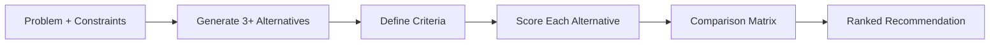

# Design Alternatives

Generate structured engineering design alternatives and compare them against
the problem constraints. This skill is for exploration and comparison, not
final design.

## Workflow



## Invocation

```
/design-alternatives <problem statement>
```

Include constraints: performance targets, budget limits, spatial constraints,
code requirements, environmental conditions, timeline.

## Methodology

1. **Parse constraints** — hard (must meet), soft (preferences), evaluation criteria. Ask if unclear.
2. **Generate 3-5 alternatives** — technically feasible, distinct approaches. Each: Approach, Governing standards, Advantages, Limitations.
3. **Comparison matrix** — score 1-5 on Performance, Cost, Feasibility, Durability, Risk, Code compliance. Weight by priorities.
4. **Recommend** — best overall + best for specific priorities + trade-offs. Do NOT recommend a single answer.

## Output

### Inline Summary (chat response)

- Problem restatement with constraints
- 3-5 alternatives with one-line descriptions
- Comparison matrix (scored)
- Recommendation with trade-offs

### Full Analysis (saved to disk)

Save to `outputs/design-alternatives/<slug>.md`: Problem Statement, Constraints, Alternatives (Approach/Governing standards/Advantages/Limitations each), Comparison Matrix (criteria × alternatives, scored 1-5 with weights), Recommendation (best overall + trade-offs).

## Scope and Boundaries

- This skill compares alternatives — it does NOT produce final designs.
- Output is research and analysis, not construction documents.
- All alternatives must have a basis in engineering practice — no speculative or unproven approaches.
- Evidence quality: see `references/evidence-quality-tiers.md`.
- **Research-only, not for final engineering sign-off.**
