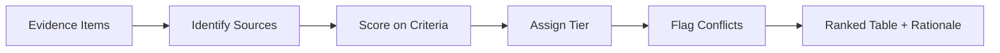

# Evidence Ranking

Score and rank engineering evidence using the tier system from `references/evidence-quality-tiers.md`. This skill provides transparent, auditable evidence scoring — never a black-box "relevance" score.

## Workflow



## Invocation

```
/evidence-ranking <research question>
```

Optionally provide a list of sources to rank. If none provided, use `scholarly-research` to discover sources first, then rank them.

## Methodology

1. **Identify evidence items** — from user input or scholarly-research discovery. Each item needs: title, authors, year, venue, DOI/URL, and a brief summary of the claim it supports.

2. **Score each source** using the criteria in `references/evidence-ranking-methodology.md`.

3. **Assign tier and confidence** — see `references/evidence-ranking-methodology.md`.

4. **Flag conflicts** — when sources disagree, identify the conflict, note which is newer, which is jurisdiction-specific, and what a decision-maker should weigh.

## Output

### Inline Summary (chat response)
- Research question
- Top 3 sources by tier and score
- Conflicts identified (if Any)
- Overall evidence strength for the question

### Full Ranking (saved to disk)

Save to `outputs/evidence-ranking/<slug>.md`:

```markdown
# Evidence Ranking: <research question>

## Question
<restated question>

## Evidence Items

| # | Source | Year | Venue | Tier | Score | Key Claim | Status |
|---|--------|------|-------|------|-------|-----------|--------|
| 1 | [Author](DOI) | 2024 | Journal | 1 | 9 | <claim> | verified |
| 2 | [Author](DOI) | 2023 | Conference | 3 | 5 | <claim> | verified |

## Tier Distribution
- **Tier 1:** <count> sources
- **Tier 2:** <count> sources
- **Tier 3:** <count> sources
- **Tier 4:** <count> sources (rejected as primary)

## Scoring Rationale

### Source 1: [title]
- **Tier:** 1 | **Score:** 9/10
- **Why:** Standard/code provision, cited by [standard], experimental validation
- **Limitations:** <scope, age, jurisdiction>

## Conflicts

### Conflict: <description>
- **Source A** says: <claim> [Tier 1]
- **Source B** says: <claim> [Tier 2]
- **Resolution:** A is newer and cited by standards; B is jurisdiction-limited

## Evidence Strength
- **Overall:** Strong / Moderate / Weak
- **Recommendation:** <what the evidence supports, with qualifications>
```

### Quality Gate (mandatory before returning)

Self-check the output. If any check fails, retry once with feedback:

1. **Source count** — at least 5 sources ranked. If < 5, expand search.
2. **Tier distribution** — at least 2 tiers represented. If all Tier 4, re-search with better terms.
3. **Scoring rationale** — each source has explicit scoring rationale. If missing, add reasoning.
4. **Conflict identification** — conflicts between sources are flagged. If none found but sources disagree, re-analyze.
5. **Evidence strength** — overall strength is stated with justification. If missing, add reasoning.

**Retry logic:** If quality gate fails, re-run the ranking once with the specific failure as feedback. If it fails again, return the best output with a `Weak` evidence strength and list the unresolved issues.

## Scope and Boundaries

- This skill scores evidence — it does NOT select the "best" source. Human engineering judgment decides.
- **Research-only, not for final engineering sign-off.**
- Never fabricate scores. If a source cannot be assessed, mark it `unverified`.
- Tier 4 sources are flagged as rejected for primary use but may support context.
- Evidence quality: see `references/evidence-quality-tiers.md`.
