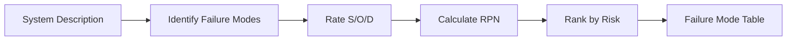

# FMEA Brainstorm

Systematically identify and rank failure modes for an engineering system or
component. This skill is for brainstorming and qualitative risk screening,
not quantitative failure analysis.

## Workflow



## Invocation

```
/fmea-brainstorm <system description>
```

Include: operating environment, loads, materials, usage profile, safety
criticality, regulatory context.

## Methodology

1. **Define system** — scope, operating conditions, safety criticality, regulatory context. Ask if incomplete.
2. **Identify failure modes** — per component: how could it fail? Consider documented failures, code-specified modes, industry databases, analogous systems.
3. **Rate S/O/D 1-10** — Severity, Occurrence, Detection. Calculate RPN = S × O × D.
4. **Rank by RPN** — Critical (RPN≥200 or S≥9), Moderate (100-200), Low (<100). Suggest mitigation + verification for critical/moderate.

## Output

### Inline Summary (chat response)

- System scope and operating conditions
- Top 5-10 failure modes ranked by RPN
- Critical items requiring action
- Suggested mitigations for top items

### Full Analysis (saved to disk)

Save to `outputs/fmea/<slug>.md`: System Definition, Failure Modes table (Component/Mode/Effect/S/O/D/RPN/Mitigation), Critical Items (RPN≥200 or S≥9) with mitigation + verification, Moderate Items, Assumptions.

## Scope and Boundaries

- This skill identifies and ranks failure modes — it does NOT produce quantitative probability data.
- Output is qualitative brainstorming, not a formal FMEA for regulatory submission.
- Ratings are engineering judgments based on available evidence, not statistical data.
- For safety-critical systems, follow up with detailed analysis (FEA, testing, reliability analysis).
- Evidence quality: see `references/evidence-quality-tiers.md`.
- **Research-only, not for final engineering sign-off.**
