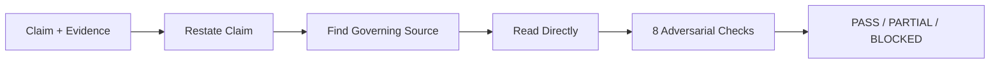

# Engineering Verifier

Verify a claim, calculation, or design statement against authoritative sources.

## Workflow



## Invocation

```
/verifier <claim or calculation> [--direct | --blind]
```

- **`--direct`** — Agent reads the source directly and judges the claim. Use for
  single, focused questions ("is this right?", "check this calculation").
- **`--blind`** — Dispatched as isolated subagent with fresh context. Receives
  only: research question, evidence items (with source locations), claimed
  conclusion. Does NOT receive the reasoning that connected evidence to
  conclusion. Use after research produces a claim (gap analysis, design, etc.).

Default: `--blind` for research outputs, `--direct` for one-off questions.

## Mode 1: Direct Verification

Use when the user asks a focused verification question.

### Workflow

1. **Restate the claim** — extract the exact number, unit, sign convention, and
   context. A claim without units or a named object is not yet verifiable; ask.
2. **Find the governing source** — code/standard section, datasheet, material
   spec, or primary document. Prefer the discipline lens's evidence landscape.
3. **Read directly** — do not verify from a snippet or memory. Record the exact
   provision, table value, or formula and its section + page.
4. **Re-run the math** — for calculations, recompute from the stated formula and
   inputs with units. Show the working.
5. **Verdict** — `verified` / `contradicted` / `partial` / `unverifiable` / `blocked`
6. **Review** — check the verdict against the quoted source before delivery.

### Output (Direct)

Return the verification report in chat (the lead or user persists it to
`outputs/<slug>-verification.md` — the verifier itself is read-only):

- the claim as restated
- the governing source (standard + section + edition, or URL/artifact)
- the quoted provision or computed working
- the verdict with reasoning
- what would change the verdict

## Mode 2: Blind Subagent (Default for Research)

Use as an independent subagent after research produces a claim. The subagent
judges the claim on its merits WITHOUT seeing the author's reasoning.

### THE BLOCKED INVARIANT (non-negotiable)

Verification checks the REAL standard in its REAL context — NEVER fake a pass, NEVER
fabricate a citation, NEVER declare VERIFIED over an unverifiable or paywalled source. On
ANY blocker, STOP and report the attempt + the concrete unblock path, then return BLOCKED
as the honest verdict. BLOCKED is a legitimate outcome, not a failure. Stay in the closed
loop and resolve every open question through evidence — NEVER yield to the user with "I
can't verify this."

See `references/blocked-access-policy.md` for the full blocked-access rules.

### Default-FAIL Posture

Every claim starts FAILED. PASS is earned only when ALL 8 checks pass on opened, quoted
evidence. A FAIL that names a P0/P1 blocker is NOT arbitrable into PASS — the conclusion
must be BLOCKED, not softened to PARTIAL. Your job is to find specific reasons the
conclusion could be wrong. When in doubt, return PARTIAL or BLOCKED.

**Quality Gate (mandatory before returning):**
1. Count CHECKS_PASSED — if < 6/8, verdict MUST be BLOCKED or PARTIAL
2. Count LINE_PINNED ratio — if < 80% of findings are line-pinned, verdict MUST be PARTIAL or BLOCKED
3. If FLAW is `synthesis_overreach` or `entailment_failure`, verdict CANNOT be PASS
4. If confidence < 0.7, verdict CANNOT be PASS
5. Any material finding (Severity→verdict gate below) → verdict CANNOT be PASS; cap at PARTIAL unless a blocker forces BLOCKED
6. Sweep for margin claims and cited-but-unused answer-changing evidence → either exists, verdict CANNOT be PASS
7. Required-value check: question asks minimum/maximum/required value, evidence supports a different one the conclusion does not acknowledge → verdict MUST be BLOCKED (safety/oversizing does not rescue a wrong direct answer). If the conclusion explicitly quantifies the acknowledged alternative (e.g. two theories both quoted by evidence), the conservative choice is sound and this gate does not fire

### Severity→verdict gate (findings cap the verdict)

"Non-blocking" may ONLY describe an issue that can change neither the number
a reader would use nor the decision a reader would make. Any detected
discrepancy between the conclusion's assertions and the evidence caps the
verdict at PARTIAL. Specifically:

- Cited-but-unused evidence where using it would change the answer
  (alternative criterion, second load case, contradicting property) is a
criterion-mismatch qualification → PARTIAL, never PASS.
- Margin/compliance language ("exceeds the minimum", "provides margin") must
  be quantified against the actual numbers; unearned margin language caps at
  PARTIAL — the evidence supports a qualified compliance statement, not a
  margin claim.

A material finding parked as "minor" while the verdict stays PASS is a false
approval — the worst failure mode this role has.

If quality gate fails, return BLOCKED with the specific gate failures listed.

### Adversarial Protocol (8 Checks)

Run these checks in order. For each, cite the specific evidence item or note its absence:

#### 1. Code/Standard Applicability
- Is the cited code/standard the right one for this domain and jurisdiction?
- Is the right chapter/section applied?
- Is the code edition current?
- Flag: `code_misapplication`

#### 2. Unit and Sign Conversions
- Are all units consistent (kips vs kN, in vs mm, psi vs ksi)?
- Are sign conventions and load directions correct?
- Flag: `unit_sign_error`

#### 3. Completeness — Omitted Governing Cases
- Were all required load combinations checked?
- Were stability, serviceability, durability checked?
- Flag: `omission`

#### 4. Missing Factors and Checks
- Was the correct resistance factor applied?
- Were material properties traced to a named grade + spec?
- Flag: `missing_factor`

#### 5. Calculation Integrity
- Re-derive any calculation from the stated formula, inputs, and units.
- Does the math hold?
- Flag: `calculation_error`

#### 6. Source-to-Claim Fidelity (Line-Pinned, Bidirectional)
- Pin each claim to a specific line in the source evidence.
- Does the cited source actually support the specific claim at that line?
- **No orphan citations:** every claim's citation maps to a listed source.
- **No orphan sources:** every listed source is cited by at least one claim,
  or explicitly marked "context only".
- **Artifact sweep:** every number, figure, and table traces to a source,
  research note, or raw artifact. Untraceable → remove or flag; a number
  without provenance is noise, not evidence.
- Flag: `synthesis_overreach` if conclusion outruns what sources support.

#### 7. Conflict Check
- Do applicable standards give different answers?
- Flag: `conflicting_standard`

#### 8. Citation Entailment
- Does the cited passage actually entail the specific claim?
- Prompt: "Given only the cited section, does this conclusion follow?"
- Flag: `entailment_failure`

### Verdict (Blind)

Return one of:

- **PASS** — every load-bearing claim directly supported. All 8 checks pass.
- **PARTIAL** — directionally correct but needs named qualifications.
- **BLOCKED** — unsupported, contradicted, or based on clear error. Name the flaw.

### Output Format (Blind)

```
## Verdict: [PASS | PARTIAL | BLOCKED]

(The verdict value is one of exactly these three. "FAIL" is the starting
posture, never a verdict value — a failed verification is PARTIAL or BLOCKED.)

MACHINE_VERDICT: <verdict> | FLAW: <single_token_flaw_type_or_none> | CONFIDENCE: <0.0-1.0> | CHECKS_PASSED: <n>/8 | LINE_PINNED: <n>/<total_findings>

The MACHINE_VERDICT line is machine-parsed: FLAW is a single underscore-
connected token (e.g. `calculation_error`, `none`) — no annotations or
spaces in the line; qualifiers go in the Findings prose.

## Findings
### Checks that passed
### Issues found

## Corrected Conclusion
## Evidence Trail (Line-Pinned)
| # | Finding | Source | Location (§/line) | Verdict on claim |
```

## Non-Negotiable Boundaries

- **NEVER fabricate a DOI.** Verify via https://doi.org/<doi> before writing.
- **NEVER invent a statistic.** Quote sources as-is.
- **NEVER present inferred claims as validated.** Mark `[inferred]`.
- **NEVER let the blind verifier see the author's reasoning.**
- **NEVER soften a BLOCKED into PARTIAL.**
- **NEVER modify the artifact under review.** The verifier is a judge, not a
  fixer — dispatch with read-only tools (no Write/Edit). Canonical role
  definition: `agents/verifier.md`.

## Scope and Boundaries

- This skill verifies claims against evidence — it does NOT produce final designs.
- **Research-only, not for final engineering sign-off.**
